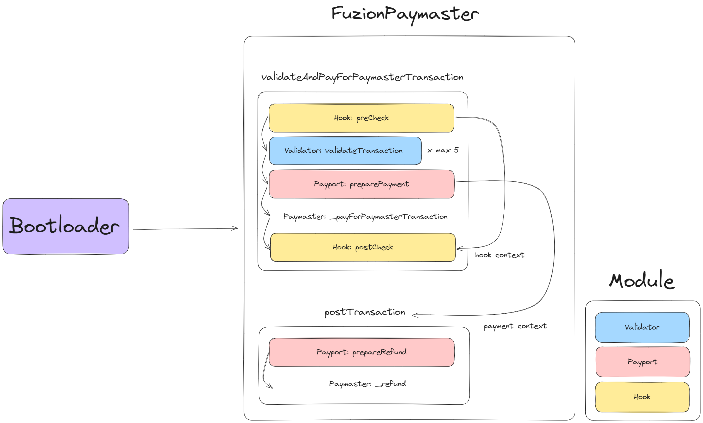

<div align="center">

<h1>Fuzion</h1>

<h3>Easy way to manage ZKsync Paymasters</h3>
</div>

## Table of Contents

- [Introduction](#introduction)
- [Inspiration](#inspiration)
- [Features](#features)
- [Paymaster Structure](#paymaster-structure)
- [Installation](#installation)
- [License](#license)
- [Contributions](#contributions)

## Introduction

Fuzion is a simple and easy way to deploy and manage ZKsync paymasters. It is a web application that allows users to deploy and manage paymasters on ZKsync in a few clicks.

## Inspiration

I found that most of the projects just use the basic paymaster provided by ZKsync. I wanted to create a simple and easy way to deploy and manage paymasters and make more developers use paymasters in a more easy way.

## Features

### Deploy Paymaster

Deploy Paymaster on ZKsync with a few clicks. Just enter the required details and click on the create button.

### Manage Paymaster

Deployed paymasters can be managed easily. You can view the details of the Paymaster and also update the Paymaster.

### Composable Paymaster

The Paymaster is designed in a composable way. It is divided into different modules like Validator, Payport, and Hook. This makes it easy to manage and update the Paymaster.

## Paymaster Structure



This diagram illustrates the structure of the `FuzionPaymaster` smart contract. The process is divided into two main stages: `validateAndPayForPaymasterTransaction` and `postTransaction`. Each stage involves various modules (Validator, Payport, Hook) that execute specific tasks. Below is a step-by-step explanation of how the function operates.

### 1. `validateAndPayForPaymasterTransaction`

This function is responsible for validating the transaction and processing the payment. The process follows these steps:

- **Hook: preCheck**

  - In this step, a pre-check is performed to ensure the transaction meets initial conditions before processing.

- **Validator: validateTransaction**

  - This step validates the transaction up to 5 times using different Validator modules. This can include checking the transaction’s signature, nonce, gas requirements, and other parameters.

- **Payport: preparePayment**

  - Once the transaction is validated, this step prepares the payment by setting the payment context and gathering necessary information. The payment can be made in ETH or ERC20 tokens based on the paymaster input selector.

- **Paymaster: \_payForPaymasterTransaction**

  - After preparing the payment, the payment is processed and transferred to the bootloader by the paymaster.

- **Hook: postCheck**
  - A post-check is conducted after the transaction is completed to ensure everything was processed correctly. Additional actions can be taken in this step.

### 2. `postTransaction`

This function handles any post-transaction tasks that might be necessary after a transaction is successfully processed:

- **Payport: prepareRefund**

  - If the payment was done in ERC20 tokens, maybe the refund is required because of overcharging or any other reason. This step prepares the refund by taking the payment data from the context.

- **Paymaster: \_refund**
  - The refund is processed and transferred to the user by the paymaster.

### Module Descriptions

- **Validator (Blue)**: Validates the transaction through various checks.
- **Payport (Pink)**: Prepares payments and refunds.
- **Hook (Yellow)**: Manages pre- and post-transaction checks and allows for additional logic to be implemented.

### Note on Payment

The actual payment and refund are handled by the Paymaster contract. Because modules are designed to be called externally to prevent the storage collision and other possible errors by using the delegatecall method, the payment and refund are done by the Paymaster contract.

## Installation

1. Clone the repository

```bash
git clone https://github.com/piatoss3612/ZKsync-fuzion.git
```

2. Install the dependencies

```bash
cd frontend && yarn install
```

3. Run the application

```bash
yarn dev
```

4. Open the application in the browser

```bash
http://localhost:3000
```

## License

This project is licensed under the MIT License - see the [LICENSE](LICENSE) file for details.

## Contributions

If you have any suggestions or improvements, feel free to create an issue or a pull request. This project is open for contributions. 🚀
